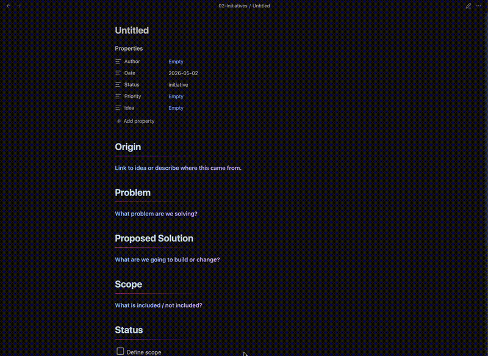
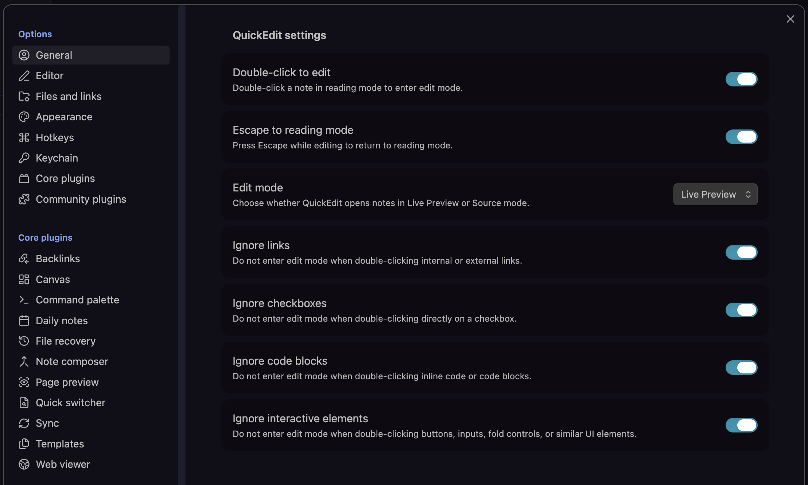

# QuickEdit

QuickEdit makes switching into edit mode feel more natural in Obsidian.

Double-click a note in Reading mode to start editing. Press Escape to return to Reading mode.

## Features

- Double-click to enter edit mode
- Press Escape to return to Reading mode
- Places the cursor near where you clicked when possible
- Ignores links so double-clicking a link does not trigger edit mode
- Optional settings for checkboxes, code blocks, and interactive elements
- Supports Live Preview or Source mode

## Screenshots





## Usage

1. Open a note in Reading mode.
2. Double-click in the note body to enter edit mode.
3. Press Escape to return to Reading mode.

QuickEdit only responds to double-clicks while a note is already in Reading mode, so normal double-click behavior inside edit mode is preserved.

## Settings

QuickEdit includes settings for:

- Double-click to edit
- Escape to Reading mode
- Edit mode preference: Live Preview or Source mode
- Links and checkboxes are protected by default so Obsidian’s normal behavior is preserved
- Optional safeguards for code blocks and interactive elements
- Ignore code blocks
- Ignore interactive elements

## Manual installation

1. Download the latest release files:
   - `main.js`
   - `manifest.json`
2. Create this folder in your vault:

```text
.obsidian/plugins/quickedit/
```

3. Move `main.js` and `manifest.json` into that folder.
4. Restart Obsidian.
5. Go to **Settings → Community plugins** and enable **QuickEdit**.

## Development

Install dependencies:

```bash
npm install
```

Build the plugin:

```bash
npm run build
```

Run in development/watch mode:

```bash
npm run dev
```

---

## Release checklist

Before creating a new release:

- [ ] Update version in `manifest.json`
- [ ] Update version in `package.json`
- [ ] Update `versions.json`
- [ ] Run `npm run build`
- [ ] Verify `main.js` is up to date
- [ ] Commit changes
- [ ] Create git tag (e.g. `git tag 0.2.1`)
- [ ] Push tag (`git push origin 0.2.1`)
- [ ] Create GitHub release with:
  - `main.js`
  - `manifest.json`
- [ ] Test install from release in a fresh vault

## Known limitations

Cursor placement is best-effort. Obsidian needs to switch from Reading mode into the editor, and some rendered elements may not map perfectly back to an exact editor position.

## Acknowledgements

QuickEdit was inspired by the general idea of using double-click and Escape to move between reading and editing states in Obsidian. This implementation was built with additional settings, safer event handling, cursor placement, and interaction safeguards.

## License

MIT